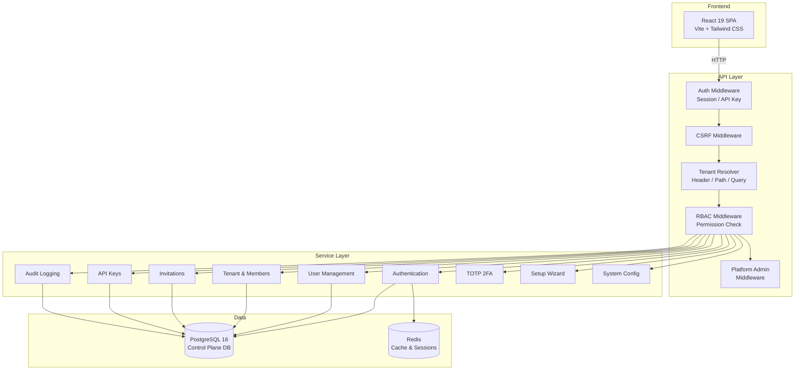

<div align="center">

# Multi-Tenant SaaS Platform Template

[](https://www.gnu.org/licenses/agpl-3.0)
[](https://go.dev/)
[](https://react.dev/)
[](https://www.postgresql.org/)
[](https://www.docker.com/)

**Production-ready GoFrame + React template for building multi-tenant SaaS applications.**

Start building your SaaS product today — with authentication, multi-tenancy, RBAC, and audit logging already solved.

[Quick Start](#-quick-start) ·
[Documentation](docs/) ·
[Roadmap](docs/roadmap.md) ·
[Contributing](#-contributing)

</div>

---

## What is this?

A **batteries-included SaaS control-plane** that handles everything every multi-tenant application needs — so you can focus on your product's unique value instead of rebuilding auth, tenants, permissions, and audit trails from scratch.

**The problem:** Every SaaS product needs the same foundation: user registration, tenant isolation, role-based access control, API key management, audit logging. Rebuilding this for each new product wastes weeks.

**This solution:** Clone this template, add your business tables (bound to `tenant_id`), and you have a working SaaS product in hours, not months. It's intentionally stripped of billing, quotas, and package management — you add your own commercial model on top.

## Table of Contents

- [Features](#-features)
- [Architecture](#-architecture)
- [Tech Stack](#-tech-stack)
- [Quick Start](#-quick-start)
- [Usage](#-usage)
- [Project Structure](#-project-structure)
- [Documentation](#-documentation)
- [Roadmap](#-roadmap)
- [Contributing](#-contributing)
- [License](#-license)

## ✨ Features

### Authentication & Sessions
- **Password login** with bcrypt-hashed credentials
- **Session management** with secure HTTP-only cookies
- **CSRF protection** via double-submit cookie pattern
- **Login attempt tracking** with configurable account lockout
- **Password reset** flow with time-limited tokens
- **Email verification** workflow

### Multi-Tenancy
- **Tenant context resolution** — automatic tenant detection from request headers, path, or query parameters
- **Tenant membership** — invite users, manage roles (Owner, Admin, Member, Viewer)
- **Tenant isolation** — all queries scoped by tenant, enforced at the middleware layer
- **Lazy tenant creation** — tenants are created on first meaningful action, not at registration
- **Tenant lifecycle jobs** — automated provisioning and cleanup

### Access Control
- **Tenant-level RBAC** — 4 built-in roles with granular permissions
- **Platform-level RBAC** — separate admin roles (Super Admin, Support, Auditor) for managing the platform itself
- **Permission middleware** — declarative `RequirePermission` checks on every endpoint
- **API key management** — personal API keys with tenant-scoped grants

### Audit & Observability
- **Comprehensive audit logs** — every write operation is recorded with actor, target, action, and metadata
- **Tenant-scoped audit trail** — tenants can view their own audit history
- **Platform audit view** — admins can search across all tenants
- **OpenTelemetry tracing** and **Prometheus metrics** endpoints
- **Structured logging** with request ID propagation

### Platform Administration
- **System configuration UI** — manage platform settings without touching code
- **Setup wizard** — guided first-time installation flow
- **User management** — platform admins can view and manage users across tenants
- **CLI tooling** — 12+ CLI commands for tenant/user/admin lifecycle management

### Developer Experience
- **Docker Compose** — one-command startup for the full stack
- **Database migrations** with up/down support (60+ versioned migrations)
- **Go E2E test framework** — full HTTP-level integration tests
- **TypeScript frontend** with lazy-loaded routes and TanStack Query
- **Internationalization** — built-in i18n with Chinese support

## 🏗 Architecture



**Request flow:** `Rate Limit → Auth → CSRF → Tenant Resolver → RBAC → Platform Admin → Controller → Logic → DAO`

**Design principles:**
- Tenant is the **security, audit, and data isolation boundary**
- Platform admins manage the platform but **cannot bypass tenant audit**
- Business tables only need a `tenant_id` column + a foreign key — isolation is automatic
- The template **deliberately excludes** billing, quotas, subscriptions — you add your commercial model

## 🛠 Tech Stack

| Layer | Technology | Version |
|-------|-----------|---------|
| **Backend Framework** | [GoFrame](https://goframe.org/) | v2.10 |
| **Language** | [Go](https://go.dev/) | 1.25 |
| **Frontend** | [React](https://react.dev/) + [TypeScript](https://www.typescriptlang.org/) | 19 |
| **Build Tool** | [Vite](https://vitejs.dev/) | latest |
| **CSS** | [Tailwind CSS](https://tailwindcss.com/) | v4 |
| **Routing** | [React Router](https://reactrouter.com/) | v7 |
| **Data Fetching** | [TanStack Query](https://tanstack.com/query) | latest |
| **State** | [Zustand](https://zustand.docs.pmnd.rs/) | latest |
| **Validation** | [Zod](https://zod.dev/) | latest |
| **Charts** | [Recharts](https://recharts.org/) | v3 |
| **Icons** | [Lucide React](https://lucide.dev/) | latest |
| **i18n** | [i18next](https://www.i18next.com/) | v26 |
| **Database** | [PostgreSQL](https://www.postgresql.org/) | 16 |
| **Cache** | [Redis](https://redis.io/) | 7 |
| **Migrations** | [golang-migrate](https://github.com/golang-migrate/migrate) | v4 |
| **2FA** | [pquerna/otp](https://github.com/pquerna/otp) | v1 |
| **OAuth2** | [golang.org/x/oauth2](https://pkg.go.dev/golang.org/x/oauth2) | latest |
| **Telemetry** | [OpenTelemetry](https://opentelemetry.io/) | latest |

## 🚀 Quick Start

### Prerequisites

- [Docker](https://docs.docker.com/get-docker/) and Docker Compose
- Or: Go 1.25+, Node.js 22+, PostgreSQL 16+, Redis 7

### Option 1: Docker (Recommended)

```bash
# Clone and start everything
git clone https://github.com/ChamHerry/multi-tenant-saas.git
cd multi-tenant-saas
scripts/manage-docker.sh start

# The app is at http://127.0.0.1:8000
# PostgreSQL is on localhost:55432 (inside Docker network only by default)
```

### Option 2: Docker Dev Mode (with hot-reload)

```bash
# Start dev environment with source mounting
scripts/manage-docker.sh dev
```

### Option 3: Manual Setup

```bash
# Clone the repo
git clone https://github.com/ChamHerry/multi-tenant-saas.git
cd multi-tenant-saas

# Start infrastructure
docker compose up -d postgres redis

# Install frontend dependencies and build
cd web && npm install && npm run build && cd ..

# Run the server (serves both API and SPA)
go run .

# Or use Makefile targets
make dev          # go run .
make web          # npm run dev (frontend dev server)
make build        # npm build + Go build
```

The app will be available at `http://127.0.0.1:8000`.

On first launch, the **Setup Wizard** guides you through creating the initial platform admin account. Once set up, you can start creating tenants and inviting users.

### Docker Management Commands

```bash
scripts/manage-docker.sh help      # Show all commands
scripts/manage-docker.sh start     # Start all services
scripts/manage-docker.sh stop      # Stop all services
scripts/manage-docker.sh logs      # View logs
scripts/manage-docker.sh psql      # Open PostgreSQL shell
scripts/manage-docker.sh clean     # Stop and remove containers/volumes
scripts/manage-docker.sh status    # Show service status
```

## 💻 Usage

### API Overview

All tenant-scoped endpoints require authentication and pass through the middleware chain.

```bash
# Authentication
POST /api/v1/auth/register          # Register new user
POST /api/v1/auth/login             # Login with password
POST /api/v1/auth/logout            # End session
POST /api/v1/auth/forgot-password   # Request password reset
POST /api/v1/auth/verify-email      # Verify email address

# Current User
GET  /api/v1/me                     # Get current user profile
GET  /api/v1/me/sessions            # List active sessions

# Tenants
GET    /api/v1/tenants              # List my tenants
POST   /api/v1/tenants              # Create a tenant
GET    /api/v1/tenants/{id}         # Get tenant details
PATCH  /api/v1/tenants/{id}         # Update tenant

# Members (tenant-scoped)
GET    /api/v1/tenants/{tenant}/members        # List members
POST   /api/v1/tenants/{tenant}/members        # Add member

# Invitations
POST   /api/v1/tenants/{tenant}/invitations    # Invite user
GET    /api/v1/me/invitations                  # My pending invitations

# API Keys
POST   /api/v1/api-keys                        # Create personal API key
GET    /api/v1/api-keys                        # List my API keys

# Audit Logs
GET    /api/v1/tenants/{tenant}/audit-logs     # View tenant audit trail

# Platform Admin
GET    /api/v1/admin/tenants                   # List all tenants
GET    /api/v1/admin/users                     # List all users
GET    /api/v1/admin/audit-logs                # Cross-tenant audit view
GET    /api/v1/admin/system-config             # System configuration
```

### CLI Commands

The binary includes management commands for scripting and operations:

```bash
# Tenant management
repomind tenant-create --name "Acme Corp" --slug "acme-corp"
repomind tenant-member-add --tenant-id <id> --user-id <id> --role admin
repomind tenant-member-list --tenant-id <id>
repomind tenant-lifecycle-run

# User management
repomind user-upsert --email user@example.com --name "Jane Doe"
repomind user-password-set --user-id <id> --password <pw>
repomind user-session-revoke --user-id <id>
repomind user-tenant-list --user-id <id>

# Platform admin
repomind platform-admin-grant --user-id <id> --role super_admin

# Context debugging
repomind tenant-context-resolve --host example.com --header "X-Tenant-ID: acme-corp"
```

### Testing

```bash
make test             # Unit tests + integration tests
make test-unit        # Unit tests only (~1s)
make test-integration # Integration tests (requires PostgreSQL)
make test-e2e         # Full end-to-end tests (starts Docker, runs test suite)
```

## 📁 Project Structure

```
.
├── api/                    # API request/response struct definitions
│   ├── auth/               #   Auth endpoints (register, login, reset, verify)
│   ├── tenant/             #   Tenant CRUD endpoints
│   ├── member/             #   Membership management
│   ├── invitation/         #   Invitation flow
│   ├── apikey/             #   Personal API key management
│   ├── audit/              #   Audit log queries
│   ├── admin/              #   Platform admin endpoints
│   ├── me/                 #   Current user endpoints
│   ├── setup/              #   Setup wizard endpoints
│   └── totp/               #   2FA endpoints
├── internal/
│   ├── controller/         # HTTP controllers (thin, delegates to logic)
│   ├── middleware/         # Middleware chain (auth, csrf, tenant, rbac, ...)
│   ├── service/            # Service interfaces (GoFrame DI)
│   ├── logic/              # Business logic implementations
│   ├── dao/                # Data access objects (auto-generated)
│   ├── table/              # Database table structs (auto-generated)
│   └── cmd/                # CLI commands + server entry point
├── web/                    # React 19 SPA
│   └── src/
│       ├── features/       # Domain modules (auth, tenants, audit, ...)
│       ├── pages/          # Route-level page components
│       ├── shared/         # Shared utilities, UI kit, API client
│       ├── layouts/        # App shell, auth shell, menu config
│       └── app/            # Router, providers, auth guards
├── manifest/
│   ├── config/             # Application config (YAML)
│   ├── migration/          # Database migrations (up/down SQL)
│   ├── docker/             # Docker runtime config
│   └── deploy/             # Kubernetes Kustomize manifests
├── docs/                   # Full documentation (architecture, DB, API, ...)
├── scripts/                # Docker management and dev scripts
├── test/e2e/               # Go E2E test framework and test suites
├── hack/                   # GoFrame CLI tooling config
├── utility/                # Shared utilities (crypto, redis, uuid)
├── Makefile                # Build, test, dev commands
├── docker-compose.yml      # Production-like Docker stack
├── docker-compose.dev.yml  # Development Docker stack (source mounts)
└── LICENSE                 # GNU AGPL v3.0
```

## 📖 Documentation

| Document | Description |
|----------|-------------|
| [Overview](docs/01-overview.md) | Project overview and core capabilities |
| [Architecture](docs/02-architecture.md) | Four-layer architecture and design principles |
| [Database Design](docs/03-database-design.md) | Table schemas, relationships, and migration guide |
| [Multi-Tenancy](docs/04-multi-tenant.md) | Tenant context resolution and isolation explained |
| [API Design](docs/05-api-design.md) | API grouping, middleware chain, and endpoint reference |
| [Extending the Platform](docs/06-code-parsing.md) | How to add your own tenant-bound business tables |
| [Deployment](docs/07-deployment.md) | Production deployment guide and health endpoints |
| [Roadmap](docs/roadmap.md) | Planned features across 6 phases |
| [Platform Admin & Roles](docs/wiki/platform-admin-tenant-role-model.md) | Two-tier RBAC system deep-dive |
| [Lazy Tenant Creation](docs/wiki/default-organization-lazy-tenant.md) | Default organization and tenant materialization |

## 🗺 Roadmap

See [docs/roadmap.md](docs/roadmap.md) for the full plan. Key upcoming milestones:

- **Phase 1 — Auth completion:** Password reset, email verification, TOTP 2FA, OAuth/social login, session management
- **Phase 2 — Security hardening:** CAPTCHA, login notifications, password policies, audit enhancements
- **Phase 3 — Organization:** Custom roles, teams/groups, tenant branding
- **Phase 4 — Integration:** Webhooks, email templates, file upload, bulk import/export
- **Phase 5 — Monetization:** Billing/subscriptions, usage metering, quotas
- **Phase 6 — Enterprise:** SAML/OIDC SSO, SCIM provisioning, GDPR compliance

## 🤝 Contributing

Contributions are welcome! Here's how to get started:

### Development Setup

```bash
# Clone and start dev environment
git clone https://github.com/ChamHerry/multi-tenant-saas.git
cd multi-tenant-saas

# Start infrastructure
docker compose up -d postgres redis

# Terminal 1: Go backend
go run .

# Terminal 2: React frontend dev server
cd web && npm install && npm run dev
# Frontend at http://127.0.0.1:5173, proxies API to :8000
```

### Before Submitting

1. Write tests for your changes
2. Run `make test` to ensure nothing breaks
3. Run `make test-e2e` for full integration validation
4. Follow existing code style — the project uses GoFrame conventions and React/TypeScript best practices
5. Keep PRs focused — one feature or fix per pull request

### Commit Convention

This project uses structured commit messages with sections: **What**, **How**, **Why**, **Details**, and **Impact**.

## 📄 License

This project is licensed under the **GNU Affero General Public License v3.0 (AGPL-3.0)** — see the [LICENSE](LICENSE) file for details.

**What this means:**
- ✅ You can **use**, **modify**, and **distribute** this software
- ✅ You can use it for **commercial purposes**
- ⚠️ If you **modify** the code and provide it as a **network service** (SaaS), you must **make your modifications publicly available** under the same license
- ⚠️ Any **derivative works** must also be licensed under AGPL-3.0

> For alternative licensing (e.g., commercial closed-source use), contact the copyright holder.

---

<div align="center">
  <sub>Built with GoFrame, React, and PostgreSQL</sub>
</div>
